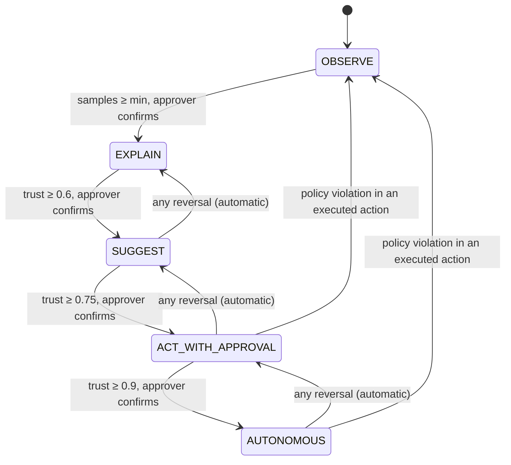

# Architecture

Plexus is a read-mostly intelligence layer with exactly one write path. This document is kept
current every session; Mermaid diagrams render on GitHub and in most editors.

## System context

```mermaid
flowchart LR
  subgraph Customer systems
    GM[Gmail] ; CU[ClickUp] ; GD[Drive] ; SL[Slack] ; PG[(Customer DB)]
  end
  subgraph Adapters (MCP, one process each)
    A1[gmail] ; A2[clickup] ; A3[gdrive] ; A4[slack] ; A5[postgres_generic]
  end
  PII[PII Boundary\ncore/pii]
  subgraph Core
    GR[(Neo4j graph)]
    DOC[(Postgres + pgvector\ndocuments, events, ledger, vault)]
    RS[(Redis streams)]
    RT[Model router\ncore/models]
    LD[Autonomy Ledger]
    EX[Executor\ncore/action/executor.py]
  end
  subgraph Agents (explicit Python)
    XT[extract] ; DS[discover] ; PL[plan / actor] ; VF[verify] ; XP[explain] ; IM[immune]
  end
  TW[Digital twin]
  TP[Temporal]
  API[FastAPI /v1] ; DB[Next.js dashboard]
  GM --> A1 ; CU --> A2 ; GD --> A3 ; SL --> A4 ; PG --> A5
  A1 & A2 & A3 & A4 & A5 --> PII --> RS
  RS --> XT --> GR ; RS --> DS --> GR ; RS --> DOC
  XT & DS & PL & VF & XP & IM --> RT
  PL --> TW --> VF --> EX
  EX -->|restore tokens, write| A2
  EX --> LD --> DOC
  TP -.orchestrates.-> XT & DS & PL & VF & EX
  API --> GR & DOC & LD ; DB --> API
```

## The action pipeline (the only write path)

```mermaid
sequenceDiagram
  participant E as Event
  participant P as Actor (plan)
  participant T as Twin (simulate)
  participant V as Verifier (other vendor)
  participant H as Human approver
  participant X as Executor
  participant A as Adapter.write
  participant L as Ledger
  E->>P: trigger + graph context (tokenised)
  P->>T: ProposedAction
  T->>V: SimulationReport + policies + ledger tail
  V-->>X: Verdict approve|reject|escalate
  alt tier = SUGGEST
    X->>L: suggestion (nothing executes)
  else tier = ACT_WITH_APPROVAL
    X->>H: Inbox item
    H-->>X: approve (role approver)
    X->>X: check paused flags, restore tokens
    X->>A: write(op)
    X->>L: execution (+ reversal op)
  else tier = AUTONOMOUS and verdict = approve
    X->>X: check paused flags, restore tokens
    X->>A: write(op)
    X->>L: execution; notify human with one-click reverse
  end
```

## Autonomy ladder



## Structural enforcement of the principles

| Principle | Where it is enforced |
|---|---|
| Single write path | `tests/architecture/test_import_boundaries.py::test_adapter_write_only_in_executor`; DB `executions.verdict_id NOT NULL` (Phase 3) |
| PII never reaches a model | adapter base `_emit()` tokenises; `restore` importable only by executor (architecture test); hypothesis fuzz (Phase 1) |
| Two-vendor separation | `Router.from_config` refuses to boot in production (Phase 1) |
| Everything traced | OTel middleware on API, Temporal interceptors, router spans (Phase 1) |
| Tenancy | Postgres RLS, `GraphStore` tenant predicate check, Redis key prefixes |
| Append-only ledger | DB trigger + revoked UPDATE/DELETE + hash chain (Phase 3) |
| Durable by default | all waiting work in `workflows/` (Temporal) |
| Model-agnostic | vendor SDK imports only in `core/models/providers` (architecture test) |
| No frameworks | ruff banned-api + architecture test |

## Local stack

`docker-compose.yml` runs Postgres (pgvector), Neo4j 5 Community (APOC), Redis 7, Temporal
(auto-setup, sharing the Postgres instance), Temporal UI, Jaeger all-in-one, Keycloak with the
`plexus` realm, Presidio analyzer and anonymizer, and the API container.
